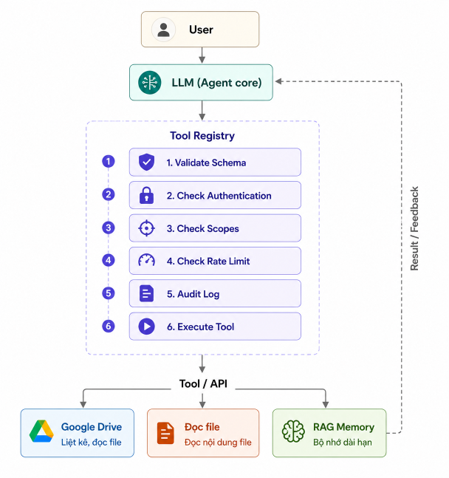

# AI Agent with Tool Registry

Một AI Agent mẫu sử dụng Claude, tích hợp Tool Registry, Google Drive, đọc tài liệu và bộ nhớ dài hạn dựa trên RAG với Qdrant.

> [!IMPORTANT]
> Đây hiện là project dạng assignment/scaffold. Một số thành phần cốt lõi vẫn được đánh dấu `TODO`; xem [Trạng thái phát triển](#trạng-thái-phát-triển) trước khi chạy hoặc triển khai.

## Tính năng

- Trò chuyện với Claude qua CLI hoặc giao diện web.
- Đăng ký và gọi tool thông qua một registry tập trung.
- Thiết kế pipeline tool gồm 6 bước: validate schema, authentication, authorization scope, rate limit, execution và audit log.
- Liệt kê, tải và đọc file từ Google Drive bằng service account.
- Chuyển đổi PDF, DOCX, XLSX, PPTX và nhiều định dạng khác sang Markdown bằng MarkItDown.
- Lưu và tìm kiếm semantic memory bằng OpenAI Embeddings và Qdrant.
- Quản lý lịch sử hội thoại riêng theo từng session trên web.

## Kiến trúc



Pipeline dự kiến của mỗi tool call:

```text
Validate schema -> Authenticate -> Check scopes -> Rate limit
                -> Execute tool -> Write audit log
```

## Cấu trúc project

```text
.
|-- agent.py                 # Vòng lặp Claude và tool use
|-- config.py                # Đọc cấu hình từ biến môi trường
|-- main.py                  # Giao diện dòng lệnh
|-- server.py                # FastAPI server và web UI
|-- registry/
|   |-- models.py            # Mô hình định nghĩa tool
|   `-- registry.py          # Pipeline Tool Registry
|-- services/
|   |-- drive_service.py     # Kết nối Google Drive API
|   |-- embedding.py         # OpenAI Embeddings
|   |-- file_reader.py       # Chuyển file sang Markdown
|   `-- vectorstore.py       # Lưu và tìm memory trên Qdrant
|-- tools/
|   |-- google_drive.py      # Các tool Google Drive
|   |-- memory.py            # Các tool RAG memory
|   `-- read_file.py         # Tool đọc file cục bộ
|-- static/
|   `-- index.html           # Giao diện chat
`-- requirements.txt
```

## Yêu cầu

- Python 3.10 trở lên.
- Docker Desktop hoặc một Qdrant server có thể truy cập được.
- Anthropic API key.
- OpenAI API key cho embeddings.
- Google Cloud service account nếu sử dụng Google Drive.

## Cài đặt

### 1. Clone repository

```bash
git clone <repository-url>
cd Assignment-1
```

Thay `<repository-url>` bằng URL GitHub của repository sau khi bạn public project.

### 2. Tạo virtual environment

Windows PowerShell:

```powershell
python -m venv .venv
.\.venv\Scripts\Activate.ps1
python -m pip install --upgrade pip
python -m pip install -r requirements.txt
```

macOS/Linux:

```bash
python3 -m venv .venv
source .venv/bin/activate
python -m pip install --upgrade pip
python -m pip install -r requirements.txt
```

### 3. Cấu hình biến môi trường

Tạo file `.env` trong thư mục gốc:

```env
ANTHROPIC_API_KEY=your_anthropic_api_key
OPENAI_API_KEY=your_openai_api_key

QDRANT_HOST=localhost
QDRANT_PORT=6333

GOOGLE_SERVICE_ACCOUNT_FILE=credentials.json
GOOGLE_DRIVE_FOLDER_ID=your_google_drive_folder_id
```

`GOOGLE_DRIVE_FOLDER_ID` có thể để trống nếu không muốn giới hạn truy vấn vào một folder mặc định.

> [!WARNING]
> Không commit `.env`, API key hoặc file service-account lên Git. Các file này đã được loại trừ trong `.gitignore`.

### 4. Chạy Qdrant

Khởi động Docker Desktop, sau đó chạy:

```bash
docker run -d --name assignment-qdrant --restart unless-stopped -p 127.0.0.1:6333:6333 -v qdrant_data:/qdrant/storage qdrant/qdrant
```

Kiểm tra container:

```bash
docker ps
```

Qdrant Dashboard có tại [http://localhost:6333/dashboard](http://localhost:6333/dashboard).

Các lệnh quản lý thường dùng:

```bash
docker stop assignment-qdrant
docker start assignment-qdrant
docker logs assignment-qdrant
```

### 5. Cấu hình Google Drive (tùy chọn)

1. Tạo project trên Google Cloud Console.
2. Bật Google Drive API.
3. Tạo service account và tải JSON key.
4. Đổi tên hoặc cấu hình đường dẫn file key qua `GOOGLE_SERVICE_ACCOUNT_FILE`.
5. Chia sẻ folder Drive cần đọc với email của service account.
6. Điền ID của folder vào `GOOGLE_DRIVE_FOLDER_ID` nếu cần.

Ứng dụng chỉ yêu cầu scope đọc: `https://www.googleapis.com/auth/drive.readonly`.

## Chạy ứng dụng

### CLI

```bash
python main.py
```

Các lệnh hỗ trợ:

| Lệnh | Chức năng |
| --- | --- |
| `/help` | Hiển thị trợ giúp |
| `/clear` | Xóa lịch sử hội thoại hiện tại |
| `/audit` | Hiển thị audit log của các tool call |
| `/memory` | Liệt kê memory đã lưu |
| `/quit` | Thoát ứng dụng |

### Web UI

```bash
python server.py
```

Sau đó mở [http://localhost:9004](http://localhost:9004). API health check có tại [http://localhost:9004/api/health](http://localhost:9004/api/health).

## HTTP API

| Method | Endpoint | Mô tả |
| --- | --- | --- |
| `POST` | `/api/chat` | Gửi tin nhắn cho agent |
| `POST` | `/api/clear` | Xóa lịch sử của một session |
| `GET` | `/api/audit?session_id=...` | Lấy audit log |
| `GET` | `/api/health` | Kiểm tra server |

Ví dụ gửi tin nhắn:

```bash
curl -X POST http://localhost:9004/api/chat \
  -H "Content-Type: application/json" \
  -d '{"session_id":"demo","message":"Xin chào"}'
```

## Trạng thái phát triển

| Thành phần | Trạng thái |
| --- | --- |
| Claude conversation loop | Đã có |
| CLI và FastAPI web UI | Đã có |
| Đăng ký tool | Đã có |
| Google Drive list/download | Đã có |
| Schema validation | TODO |
| Authentication và scope checks | TODO |
| Sliding-window rate limiter | TODO |
| Tool execution và audit logging | TODO |
| Chuyển nội dung file bằng MarkItDown | TODO |
| OpenAI embeddings | TODO |
| Lưu và tìm kiếm memory trên Qdrant | TODO |

Do pipeline trong `registry/registry.py` chưa hoàn thiện, các tool chưa thể hoạt động đầy đủ dù server và giao diện đã khởi động thành công.

## Bảo mật

- Không hard-code API key hoặc credentials trong source code.
- Không public `.env` hay JSON key của Google service account.
- CORS trong `server.py` hiện cho phép mọi origin; cần giới hạn `allow_origins` trước khi deploy production.
- User database và service API key hiện chỉ là dữ liệu demo trong source code, không phù hợp cho production.
- Chỉ bind Qdrant vào `127.0.0.1` khi chạy local; cần authentication và network policy phù hợp nếu expose ra bên ngoài.
